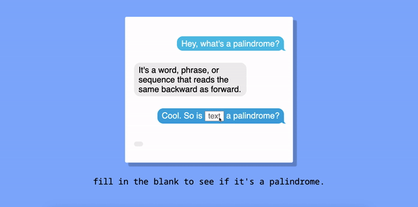

## Goal
Create a simple web application that uses the fs and http modules to validate if a string is a palindrome server side. Include vanilla ES6 js in a script tag at the bottom of your html file.

## How it's made
Made using HTML, CSS, Javascript, Node. It's also desktop, tablet, and mobile responsive.
